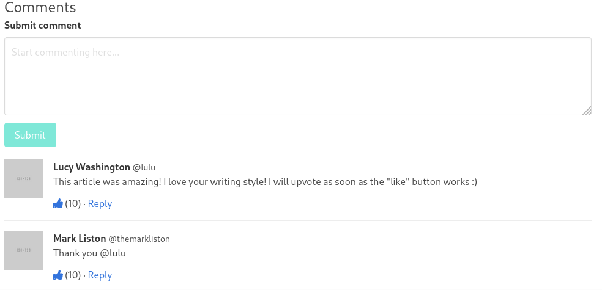
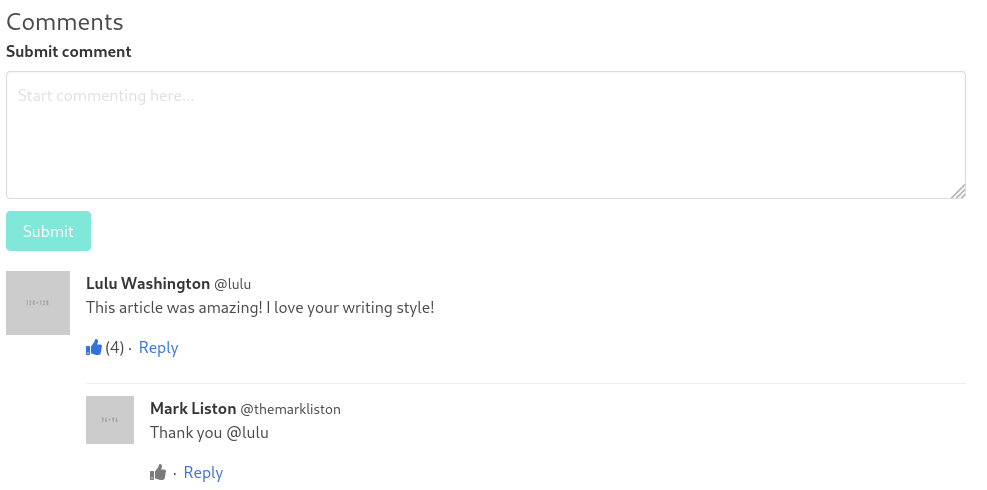

# Fantastic Blog Site Comments
## Introduction

You're a developer at "AppsRUs" where our motto is "If someone has already built it, we want to build it again!"

Keeping true to our motto, we have started development on a new blogging app that's going to revolutionize how people blog.

Feature-wise so far, if a user has an account, she can

1. Log in and out (well, it's not quite obvious how to log in and out... but she can do it!)

2. See the lists of all posts that have been created by all users

3. Create a post from the list of all posts

4. View a post from any user

5. Edit a post that she has created

6. Comment on any post

But our comment section needs some attention...

* The like button doesn't work

* The number of likes displayed is hard-coded to show (10)

* The reply button doesn't work

* Replies are not displayed in a nested fashion so you can't see which comment the reply applies to

## Your Assignment

Our site uses the [Bulma](https://bulma.io) CSS framework. 

We'd like you to improve our comments section so that it looks like this:

### Requirements
Comments should should be updated to look similar to the screenshot above. You do not have to implement avatars; the existing placeholders for user images can stay as-is.

1. Users should be able to toggle the "like" button on any comment. The "thumbs up" icon should be displayed differently, depending on if the logged in user has liked the comment or not. A user cannot like a comment more than once. If a comment has at least one like, the number of likes should be displayed next to the "thumbs up" icon, inside parenthesis. If a comment has no likes, no text should be displayed immediately next to the "thumbs up" icon. 

2. Users should be able to reply to other users' comments and see the replies "nested" under the parent comment. _You may implement the "Reply" interaction however you like_. For example, you could navigate to another page for the user to fill in the comment, or you could display a modal for the user to fill in the comment, or you could display a text area underneath the Like/Reply links - those are just a few options. The "user experience" for this interaction will not be considered when evaluating your submission.

3. Bulma limits the number of comment levels to 3. Update the code so that after 3 levels of comments, the "Reply" button is no longer displayed.

4. Comments should be ordered in a depth-first, ordered by number of likes fashion. Put another way, if Comments 1 and 2 are at the same level, but Comment 1 has more likes than Comment 2, then Comment 1 and all of Comment 1's replies and nested replies should be displayed first. In the following example, Comment A and all of its children are rendered before Comment H because A has more likes than H. Similarly for Comments B, E, and F
.

- Comment A (10 likes)
  - Comment B (5)
    - Comment C (20)
    - Comment D (1)
  - Comment E (2)
  - Comment F (1)
    - Comment G (0)
- Comment H (9)
  - Comment I (30)
  - Comment J (25)
- Comment K (8)

5. Implement a pagination feature so that when the page first loads, it only displays the first N comments. Using the example above, if N is 3, then when the page loads, Comments A, B, and C should load. When the user clicks a "More Comments" button at the end of the comments list, Comments D, E, and F should load. All comments should be rendered at the correct level.

### Things to keep in mind

* ONLY Django, Bulma, fontawesome, and jQuery are allowed. Bulma, jQuery, and fontawesome are already referenced through CDNs. No additional python, javascript, or css libraries may be used.

* While some features still need to be implemented, **your** goal is to implement the comments section. We recommend that you do not spend time refactoring, rewriting, or fixing anything unrelated to the comments section as you will **not** receive any "extra credit" for it. For example, adding login/logout to the header, signing up users, and allowing users to change their password would be **out-of-scope**.

* You may make any database table changes you need, including adding/deleting/modifying columns. 

* The decision of whether to sort each time a comment is liked or to sort periodically is up to you. Whether you want to do this on the client or server side is also up to you.

## Getting Started

### Running the server and exploring the app
1. Install Python and [Django](https://docs.djangoproject.com/en/3.0/intro/install/). No database is necessary.

2. Clone this repository. `git clone git@github.com:ckirkw/coding-challenge-python.git` or `git clone https://github.com/ckirkw/coding-challenge-python.git`

3. Using a command line terminal, navigate to `/path/to/coding-challenge/mysite`

4. Type `python manage.py migrate`

5. Type `python manage.py createsuperuser` to create an admin user

6. Type `python manage.py runserver` to start the server

7. Navigate to http://localhost:8000/admin to log in as an admin and 
create additional users and sample articles and posts

8. Logout from the admin site then navigate to http://localhost:8000/auth/login to log into the website. You can navigate to http://localhost:8000/auth/logout to log out. (The authentication feature is a work in progress, so there are no log in or log out links in the app)

9. Once you're finished using the app to understand how it works, start looking at the code. 

10. The comments section is rendered in the template at
[mysite/blog/templates/articles/detail.html](mysite/blog/templates/articles/detail.html). (Search for `Begin comments section`)

11. The [blog.js](mysite/blog/static/blog.js) file does the client-side handling for comments - retrieving comments when the page loads, adding new comments when posted

12. The [views.py](mysite/blog/views.py) file has all of the "controlling" server-side logic for articles and comments

### Resources
* [The Django Documentation](https://docs.djangoproject.com/en/3.0/)

* [The Bulma Documentation](https://bulma.io/documentation/)
  * [Bulma Media Objects](https://bulma.io/documentation/layout/media-object/)

## Submitting Your Work

Once you're finished implementing the requirements

1. Send your github account name to the recruiter so that you can be added as a collaborator

2. Once you have been added as a collaborator, create a local branch named yourgithubaccountname-submission. For example `git checkout -b johnnybgood-submission`.

3. Add and commit your code to your submission branch. `git commit -am 'This is my submission'` (you may use whatever commit message you feel is appropriate)

4. Push your code to your submission branch. `git push origin johnnybgood-submission`

5. Submit a pull request in github and add "ckirkw" as a reviewer. In your pull request and/or in the pull request comments, explain how you approached the solution. If you weren't able to solve any portion, let us know where you hit roadblocks.

Your submission will be evaluated based on **code cleanliness and correctness**. Add python or javascript comments to your changes where appropriate. We want to see your best code, database, and algorithm design.

## Questions or Difficulties?
If you have any questions about the assignment or difficulties running the project, let us know.

